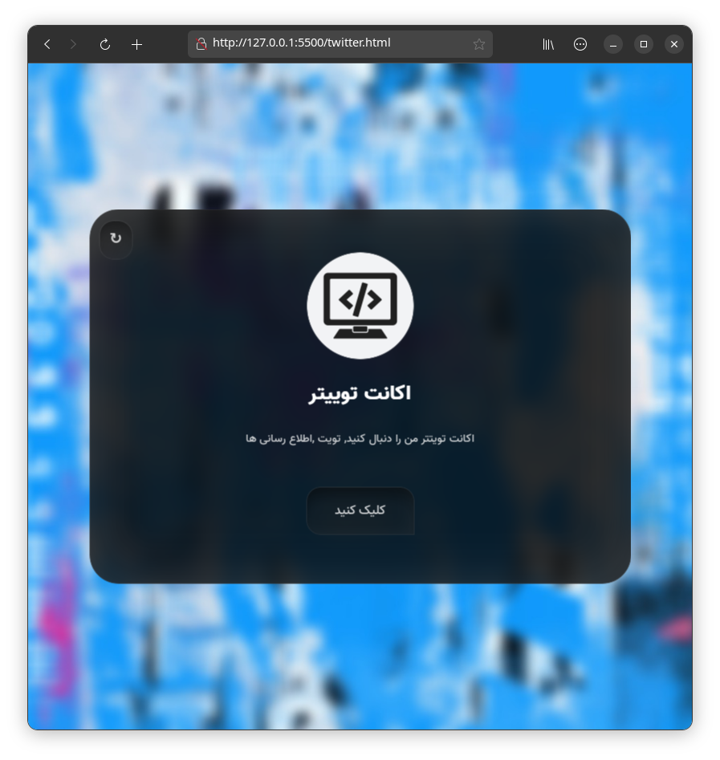
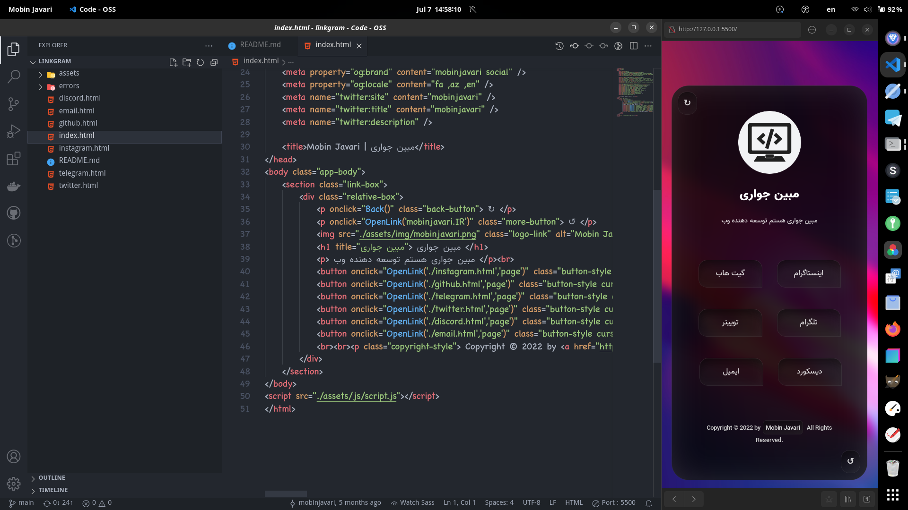

  <h1><a href="https://github.com/mobinjavari/LinkGram">Social Media Link's</a></h1>
  
Source to collect your social network address

  
<a href="instagram.com">Instagram</a> ,<a href="telegram.org">Telegram</a> ,<a href="discord.com">Discord</a> ,<a href="twitter.com">Twitter</a> ,<a href="github.com">Github</a> ,<a href="email.com">Email</a> & ...

    
  
  
      
  
  
 📬 Email me your suggestions for future eternity

